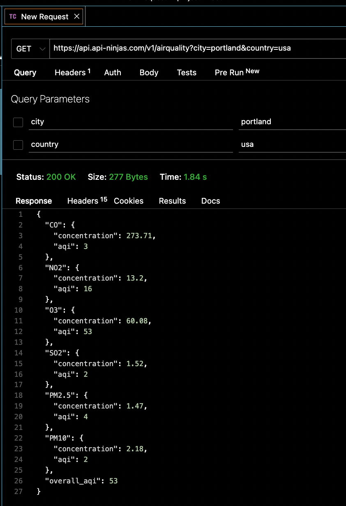

## Description
The **Air Quality Tracker** application displays the Air Quality Index (AQI) for each major and capital city on a map of the U.S. Clicking on the city shows the AQI number. 

The autocomplete search can be used, to find a paricular city. The results display the AQI number and the levels of each of pollutant (ozone, particle pollution, carbon monoxide, nitrogen dioxide and sulfur dioxide). The application only displays the current AQI, but once logged in, results can be saved to your favorites (with personal notes) for future reference.

Visit [Air Quality Index Tracker App](https://aqitracker.herokuapp.com/) to try it out.


<details>
<summary>Why is AQI important?</summary>
"Local air quality affects how you live and breathe. Like the weather, it can change from day to day or even hour to hour. The U.S.Environmental Protection Agency (EPA) and your local air quality agency have been working to make information about outdoor air quality as easy to find and understand as weather forecasts. A key tool in this effort is the Air Quality Index, or AQI. EPA and local officials use the AQI to provide simple information about your local air quality, how unhealthy air may affect you, and how
you can protect your health." 

source: [Environment Protection Agency - AQI brochure](https://www.airnow.gov/sites/default/files/2018-04/aqi_brochure_02_14_0.pdf)

</details>

<details>
<summary>Chart of AQI index values</summary>


</details>


## Local Installation Instructions

### Data and API Key Prep Instructions
1. Get Air Quality API Key from [API Ninja](https://api-ninjas.com/api/airquality)
    - This key will be used in **step 4 of Installation Instructions**
    - The site requires you to sign up for a key. There is also a limit on the number of requests you can make to the site. Under your account, the site shows you how many requests you've made, allowing you to monitor your usage. The api key is stored on your account so you can always retreive the key (or generate a new key). 
2. Get city data from [SimpleMaps](https://simplemaps.com/data/us-cities) for ```cities``` table
    -  This data will be imported in **step 6 of Installation Instructions**
    > **Please note:** SimpleMaps does not allow sharing of the data from their site (including sharing of their data stored in a database), therefore you will need to prep the data for import into the AQI Tracker database app. This can be done in either sequelize or psql.
    -  The method I used was to create INSERT statements for upload into psql, which I will outline here:
        -  Downloaded Basic (free) version of US cities data from SimpleMaps
            -  Here you have a choice of which cities to include. I included citites which SimpleMaps ranked as 1, and then I also included capital cities for each state. When making your selection, remember the API has a limited number of calls, and the map can be difficult to read if all cities are included. The cities you choose will be your dataset of citites for the application.
            -  The data is in csv format, which I opened as a google spreadsheet. I kept the columns named: city, state_id, country_name, lat, lng, ranking, and id. I used the ranking column initially as a filter, but once that was complete, I repurposed the column and used as a state_captials_flag. This column is not used in the application, but since it's a column in the psql database and sequelize models you will need to included it, although it can be an empty string ```''```.
            -  Next, I used the concatenate function in the google spreadsheet to create the insert statements for each row. Below is an example of what a couple rows would looks like. This shows what the columns must be named and what the data value format needs to be. 
                -  ```current_date``` value should be added as shown, this populates the createdAt and updatedAt columns
                -  ```simplemaps_city_id``` column name is the ```id``` on the SimpleMaps csv file, I kept it in case I needed to reference back to the original file. It's not used in the application.
                    ```
                    INSERT INTO cities (city, state_abbrv, state_name, state_capital_flag,    lat,lng,country,simplemaps_city_id,"createdAt","updatedAt") VALUES ('Montgomery','AL','Alabama','Y',32.3482,-86.2668,'US',1840008353,current_date,current_date);
                    INSERT INTO cities (city, state_abbrv, state_name, state_capital_flag, lat,lng,country,simplemaps_city_id,"createdAt","updatedAt") VALUES ('Juneau','AK','Alaska','Y',58.4546,-134.1739,'US',1840023306,current_date,current_date);
                    ```
            - Once all the insert statements were created for each city, I copied and pasted them as values (in google spreadsheet) to remove the formulas. The last step is to copy all the statements at once and paste them into the psql terminal, they will run through automatically creating each row in the database.
4. Get Air Quality Index descriptive data for ```air_quality_index_descs``` table
    - This data will be imported in **step 6 of Installation Instructions**
    - In the file called ```AirQualityIndexDescriptions.txt``` are all the INSERT statements, you just need to copy them all and paste it directly into the psql terminal, as detailed in step 6 of the Installation Instructions. They will run through automatically creating each row in the database.


### Installation Instructions

1. Fork and clone this repository
2. Open your terminal, navigate to the folder for this repository, and run the following commands: <br>
    ```npm install```  -- installs node manager <br>
    ```touch .env``` -- creates a file for secrets and api keys
3. There should be a .gitignore file with mode_modules and .env listed, if not, run the following commands:<br>
   ```echo node_modules >> .gitignore``` <br>
   ```echo .env >> .gitignore```
4. In the .env file type the api key and secret as follows, and save the file:<br>
    ```API_KEY='replace this text with the API KEY you get from API Ninja when you sign up, keep the single quotes' ```<br>
    
    ```SECRET='replace this text with add any string you would like to use for the secret, keep the single quotes'```<br>

5. Create the database and migrate the data modeling using sequelize 

> Option: if you'd like a different database name, go to config --> config.json and change the name listed under "database" for "development" and save the file.

- when you are ready to create the database and models, run the commands:<br>
    ```sequelize db:create``` <br>
    ```sequelize db:migrate```

6. Populate the database tables called cities and air_quality_index_descs using your preferred method
> #### Note about table names in psql vs sequelize:
> **psql** table names will be pluralize as in ```cities``` and ```air_quality_index_descs```
> **sequelize** will reference the same tables in the singular as in ```city``` and ```air_quality_index_desc```

7. Once set up is complete, you can access your database tables and run the app on your local machine
    - to access your database tables:
        - in the folder for the project, type ```psql``` to get the database terminal
            - ```\l``` - lists all your databases
            - ```\c databasenamehere``` - connects you to your database
                - once connected 
                    - ```\dt``` - lists all your tables
                    - ```select * from cities;``` -- shows all data in cities table
    - to set up your local:
        - in the folder for the project, type ```nodemon``` -- this will start your express server
        - in the browser, type ```localhost:3000``` to see the app (the port number can be changed in the index.js file where PORT is defined)


## Technologies
- JavaScript
- HTML 
- CSS
- Express
- Sequelize
- EJS
- Crypto-js
- Dotenv
- Bcrypt
- Axios
- Bootstrap
- Postgres
- Data API: 
[AQI API from api-ninjas.com](https://api-ninjas.com/api/airquality)
- Map rendering: 
[Leaflet | Open Street Maps](https://leafletjs.com/)

## Approach
This project is a proof of concept. The goal was to learn about API's, map imaging, map data, and retrieving and rendering data from multiple sources on a web application. Throughout the project I needed to make decisions about scoping and how far to investigate or develop a particular part of the application. Ultimately I landed on the following:
- Limiting results to U.S. cities (major and capital cities only), and incorporating a map
    - The API has a retrieval limit, so I needed to limit the number of API calls. By limiting the number of cities I was able to limit the number of calls when the map is rendered as the home page is loaded.
    - In order to map the data, coordinates for the city are needed. The API used did not provide coordinates in their results, so I needed a table that could convert the city to coordinates. Including non-US cities would be a larger scope. 
    - There are thousands of U.S. cities. Having visuals on a map for that many cities could be overwhelming and would require a lot more time to figure out how to represent them in a simple design. The limited data points supported the goal of a simple, and easily absorbed design.
- Retrieving the correct information for a city (which includes city, state and country information)
    - The API only requires city, but there are many U.S. cities with the same name (for example: Portland ME and Portland OR). The API doesn't tell you which city it's returning data for. Therefore searches were coded to send the state and country information. I didn't want the user to be required to enter state and country information so I implemented a autocomplete in the search box. 
- Quick, easy, simple styling
    - Bootstrap was used to style, which allowed for quick development
- Not incorporating validations or user messages
    - Due to time, the application did not focus on validations or providing user feedback when the application is not responsive.

### User stories
- As a user, I would like to search for the AQI for a city in the United States
- As a user, I would like to save my search results for tracking purposes
- As a user, I would like to add and modify notes associated with the search results I've saved


### MVP goals
- Page where user can search for a US city and get AQI results for that city (from an API)
    <details>
    <summary>expand to see API results</summary>
    
    </details>
- Ability for user to login, which allows them to save their search results
    - user should be able to logout
- Mechanism that allows user to save the search result for that city
- Page that allows user to see all their search results
    - user should be able to add and modify comment associated with their search results
    - user should be able to delete a saved search result

### Stretch goals
- Page that visualizes the AQI for the United States, to allow for an overall country view
    - this could be a map of the US with the number or color of the AQI listed for each state capital such as shown in [Leaflet Choropleth Map Tutorial Page](https://leafletjs.com/examples/choropleth/)  
- Improve flow to allow a user to move from an overall country view: 
    - to a more specific view
    - and/or adding to their favorites
- Add the ability to sort the favorites list in different ways
- Add the ability to save the sort preference for their favorites list
- Improve styling
- Expand view to include other countries

## Wireframes


## ERD


<details>
<summary>Potential stretch goals ERD</summary>


</details>

## RESTful routing chart


| URL                      | CRUD   | HTTP verb | Example                                                            |
|:------------------------ | ------ |:--------- |:------------------------------------------------------------------ |
| /                        | READ   | GET       | loads home page with map                                           |
| /user                    | POST   | CREATE    | create new user                                                    |
| /user                    | GET    | READ      | get user profile                                                   |
| /search/citystatecountry | GET    | READ      | display results of AQI from city search                            |
| /search/citystatecountry | POST   | CREATE    | add search results to favorites when user logged in                |
| /favorite                | GET    | READ      | display list of favorites, for a user, ordered by create date desc |
| /favorite/city           | GET    | READ      | display list of favorites, for a user, ordered by city desc        |
| /favorite/aqi            | GET    | READ      | display list of favorites, for a user, ordered by aqi desc         |
| /favorite                | PUT    | UPDATE    | update comment on favorite for a user                              |
| /favorite                | DELETE | DESTROY   | delete favorite from list for a user                               |
| /api/cities              | GET    | READ      | displays all cities with AQI API data (for use by map client-side) |


## Post project

I learned a lot from this proof of concept. To highlight a few items:

- There is a lot more to learn about geographical data, environmental data, API's, and what is available to the public.
    - The method chosen to get the cities data was chosen due to time. There are API's to get that data, but there could be retreival limits. If downloading data, formatting, and uploading to a database is the better option, then perhaps writing a script to format data for sequelize or psql from csv would be a good use of time (if one doesn't exist).
    - This project focused on simple longitude and latitude for a city, but I'd like to learn more about geographical and environmental data that is available for public use.
- API data can be unreliable and limited.
    - Sometimes the API works for batch requests, and sometimes it doesn't. This detail is not always provided on the website for the API, especially when it's free, so one would need to monitor it over a period of time and retieving various volumes of data before knowing if it could be used for their project. 
    - The API I chose has enough retrievals for a personal project, but a different API would be required for a production application or a larger user base. Depending on how often the data needed to be refreshed, there could be a job that gets the data from the API and stores it daily to a database.
    - Changing an API could require code refactoring since they could require different input to get the same output. Perhaps writing the code in a way that makes swapping out API's easier, would be useful.
- Server-side vs. client-side data delivery and consumption was something that came up during this project. This is an area I'd like to delve deeper into.
- Validations were not implemented, but it's something I'd like to incorporate in this project in the future.


## Source citations
- [Leaflet | Open Street Maps](https://leafletjs.com/)
- [AQI API from api-ninjas.com](https://api-ninjas.com/api/airquality)
- [SimpleMaps](https://simplemaps.com/data/us-cities)
- [Map Legend from haakseth on codepen](https://codepen.io/haakseth/pen/KQbjdO)


