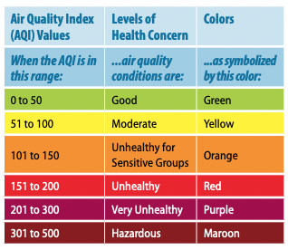
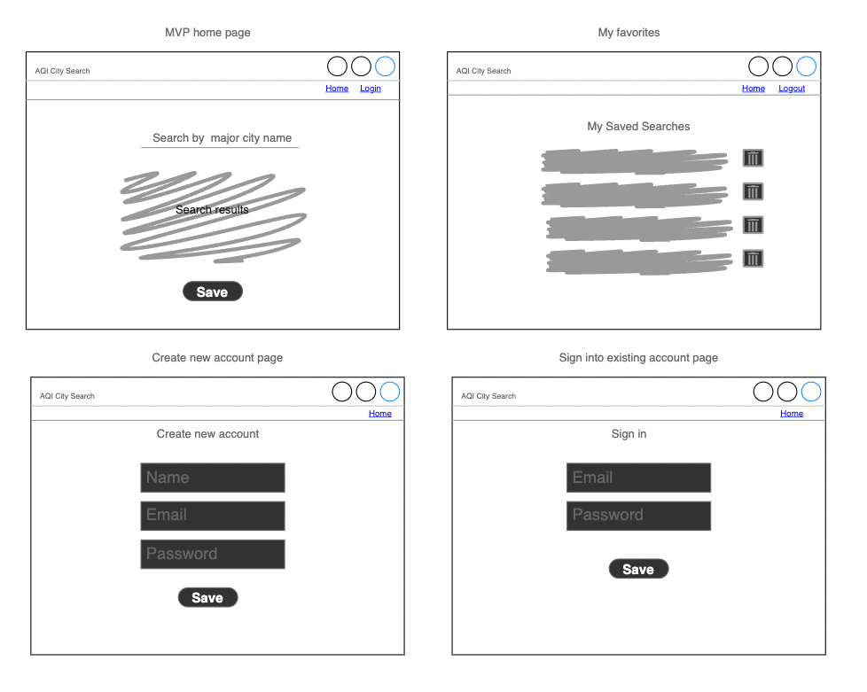
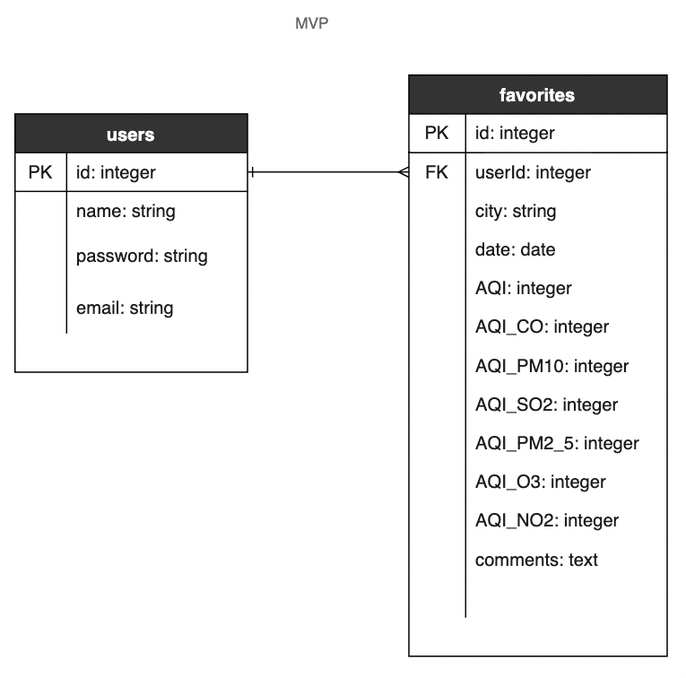
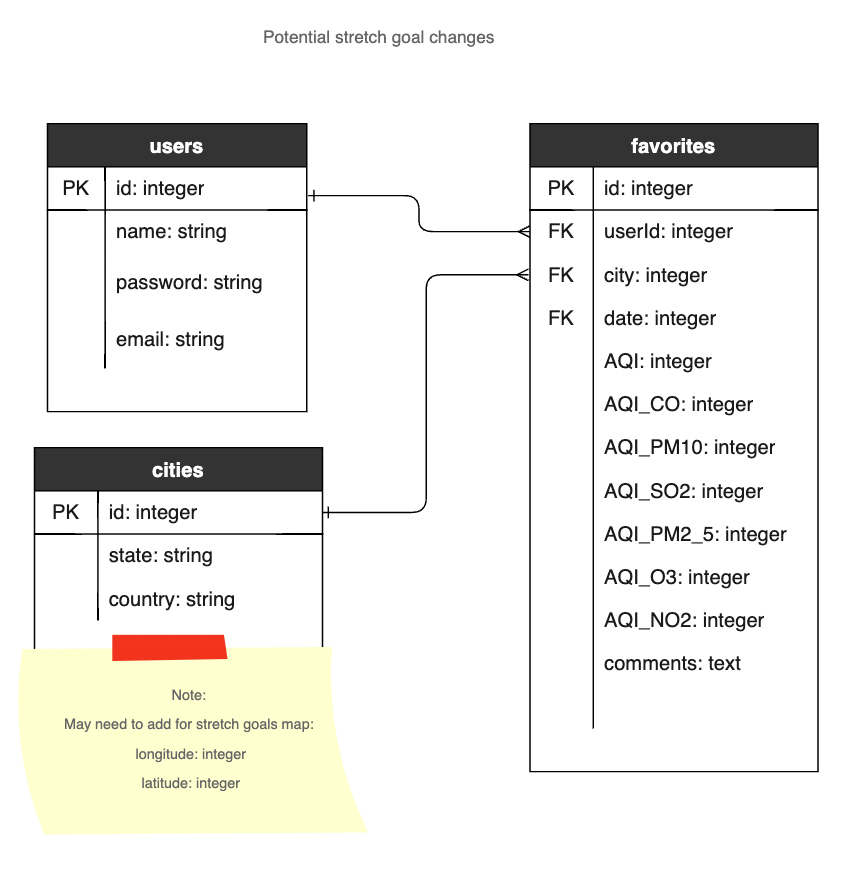
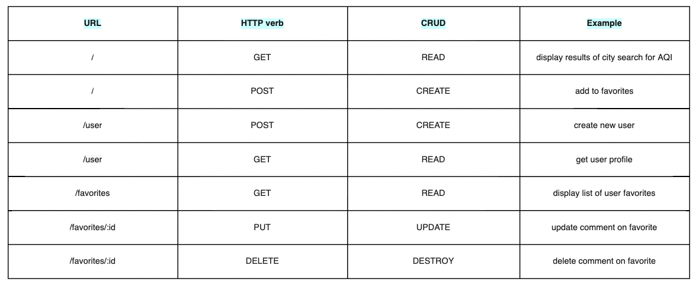

## Description
The **Air Quality Search and Save** application allows you to find the Air Quality Index (AQI) for a city in the United States. It will also display the levels of each of pollutant that goes into the AQI: ozone, particle pollution (also called particulate matter), carbon monoxide, nitrogen dioxide and sulfur dioxide. The application only displays the current AQI, but you can save your result to your favorites for your own tracking and add personalized notes.

<!-- Visit [Air Quality Index by City](https://kittens.com/) to try it out.  -->

Why is AQI important?

Local air quality affects how you live and breathe. Like the weather, it can change from day to day or even hour to hour. The U.S.Environmental Protection Agency (EPA) and your local air quality agency have been working to make information about outdoor air quality as easy to find and understand as weather forecasts. A key tool in this effort is the Air Quality Index, or AQI. EPA and local officials use the AQI to provide simple information about your local air quality, how unhealthy air may affect you, and how
you can protect your health. 

source: [Environment Protection Agency - AQI brochure](https://www.airnow.gov/sites/default/files/2018-04/aqi_brochure_02_14_0.pdf)

Chart of AQI index values

## Installation Instructions
//TODO

## Technologies
- Java Script
- HTML 
- CSS
- Express
- Node (sequelize, ejs, crypto-js)
- Postgres
- Data API: 
[AQI API from api-ninjas.com](https://api-ninjas.com/api/airquality)
- Map rendering: 
[Leaflet | Open Street Maps](https://leafletjs.com/)

## Approach

//TODO

### User stories
- As a user, I would like to search for the AQI for a city in the United States
- As a user, I would like to save my search results for tracking purposes
- As a user, I would like to add and modify notes associated with the search results I've saved

### MVP goals
- Page where user can search for a US city and get AQI results for that city
- Ability for user to login, which allows them to save their search results
    - user should be able to logout
- Mechanism that allows user to save the search result for that city
- Page that allows user to see all their search results
    - user should be able to add and modify comment associated with their search results
    - user should be able to delete a saved search result

### Stretch goals
- Page that visualizes the AQI for the United States, to allow for an overall country view
    - this could be a map of the US with the number or color of the AQI listed for each state capital such as shown in [Leaflet Choropleth Map Tutorial Page](https://leafletjs.com/examples/choropleth/)  
- Improve flow to allow a user to move from an overall country view: 
    - to a more specific view
    - and/or adding to their favorites
- Add the ability to sort the favorites list in different ways
- Add the ability to save the sort preference for their favorites list
- Improve styling
- Expand view to include other countries

## Wireframes

## ERD

Potential stretch goals ERD

## RESTful routing chart

## Post project
//TODO

## Source citations
- [Leaflet | Open Street Maps](https://leafletjs.com/)
- [AQI API from api-ninjas.com](https://api-ninjas.com/api/airquality)

